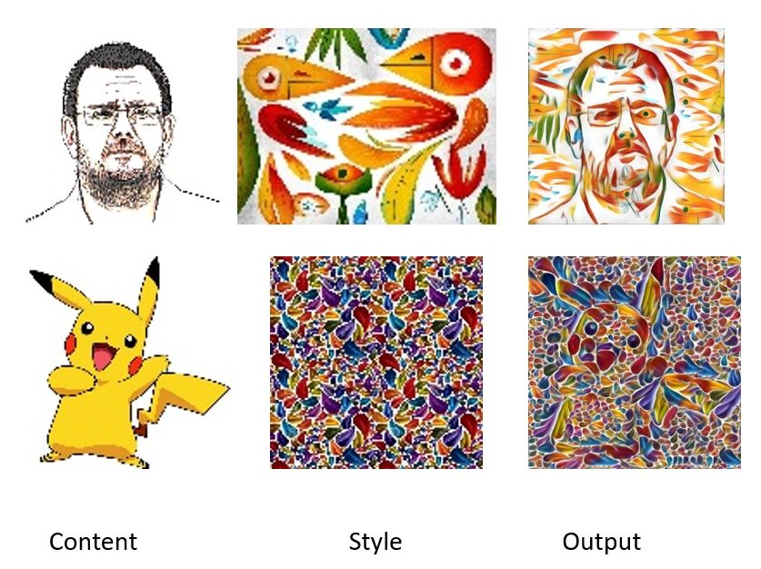

# Arbitrary Style Transfer with Deep Feature Reshuffle

The major contributors of this repository include Shuyang Gu, Congliang Chen, [Jing Liao](https://liaojing.github.io/html/index.html), [Lu Yuan](http://www.lyuan.org/) at Microsoft Research.

## Introduction

**Deep Feature Reshuffle** is a technique to using reshuffling deep features of style image for arbitrary style transfer. It connects both global and local style constrain respectively used by most parametric and non-parametric neural style transfer methods.




## Disclaimer
This is an official C++ combined with CUDA implementation of "Arbitrary Style Transfer with Deep Feature Reshuffle". It is worth noticing that:
- Our codes are based on [Caffe](https://github.com/Microsoft/caffe).
- Our codes only have been tested on Windows 10 and Windows Server 2012 R2 with CUDA 8 or 7.5.
- Our codes only have been tested on several Nvidia GPU: Titan X, Titan Z, K40, GTX770.


## License
© Microsoft, 2018. Licensed under a MIT license.

## Citation
If you find **Deep Feature Reshuffle**  helpful for your research, please consider citing:
```
@inproceedings{gu2018arbitrary, 
title={Arbitrary Style Transfer with Deep Feature Reshuffle}, 
author={Gu, Shuyang and Chen, Congliang and Liao, Jing and Yuan, Lu}, 
booktitle={Proceedings of the IEEE Conference on Computer Vision and Pattern Recognition}, 
pages={8222--8231}, 
year={2018} 
} 
```

## Getting Started

### Prerequisite

- Windows 7/8/10
- CUDA 8 or 7.5
- Visual Studio 2013

### Build

- Build [Caffe](http://caffe.berkeleyvision.org/) at first. Just download and follow the tutorial [here](https://github.com/Microsoft/caffe).
- Put ```style_feature_reshuflle``` under ```windows/```
- Edit ```style_feature_reshuffle.vcxproj``` under ```style_feature_reshuffle``` to make the CUDA version in it match yours .
- Open solution ```Caffe``` and add ```style_feature_reshuffle``` project.
- Build project ```style_feature_reshuffle```.

### Running code
-style_feature_reshuffle content_image_name style_image_name output_image_name gpu_id
